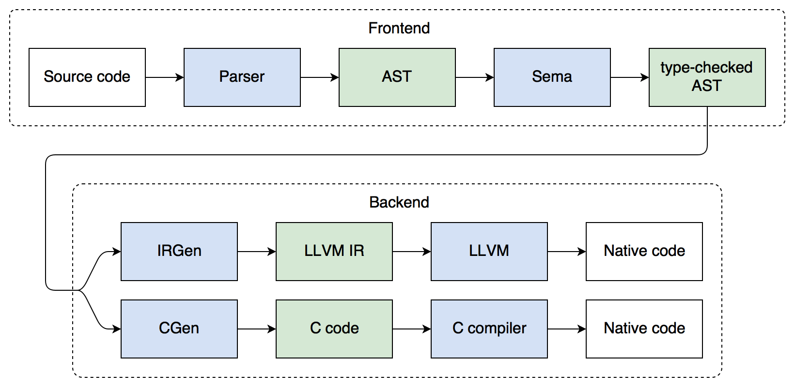

# Delta Compiler Internals

This document gives a high-level overview of the design and internal details of
this reference implementation of the Delta programming language.

## Structure

The above flowchart shows the path from Delta source code to a binary
executable. The blue boxes represent libraries, while the green boxes represent
the intermediate data structures those libraries operate on. It consists of the
following components:

1. The __Parser__ reads Delta source code from disk, tokenizes and parses it,
   and builds an AST based on it, reporting any syntax errors it encounters.
   This step also registers declarations in the symbol table to be used by Sema.
2. The __AST__ (abstract syntax tree) is an internal representation of the Delta
   source code. Some identifier references are still unresolved in this initial
   AST.
3. __Sema__ (semantic analysis) takes the AST, annotates its nodes with type
   information, and resolves all identifier references. It also reports semantic
   errors such as type system violations and uses of undeclared identifiers.
4. The __type-checked AST__ is the result of semantic analysis, an AST with full
   type information at each node that represents a typed language entity.
5. Based on the type-checked AST, we can use one of the following to generate
   native code:
   - __IRGen__ to first generate [LLVM](http://llvm.org) IR (intermediate
     representation), and then have LLVM generate the machine code for it.
   - __CGen__ (obsolete) to generate (minified) C code, that we can then pass on
     to any C compiler to handle the machine code generation.
