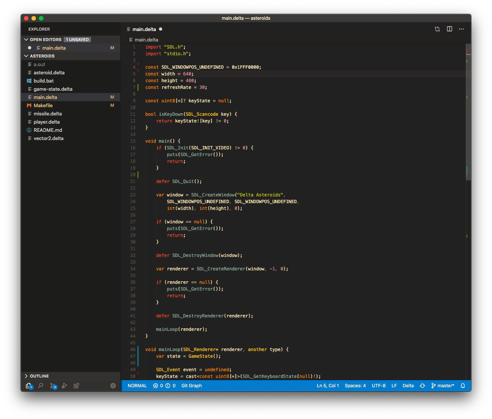

# VS Code extension for cx

VS Code language support for the [cx programming language](https://github.com/cx-language/cx).

<p align="center">
  
</p>

## Features

- Syntax highlighting and snippets
- Language server integration (`cx-lsp`): diagnostics as you type, hover signatures, go to definition, completions, document outline, find references, and semantic highlighting

## Requirements

The language server features need the `cx-lsp` binary on `PATH` (built from this repo, or shipped with cx releases). Set `cx.languageServer.path` if it lives elsewhere. Syntax highlighting and snippets work without it.

## Extension settings

- `cx.languageServer.path`: path to the `cx-lsp` executable (default: `cx-lsp` on `PATH`)
- `cx.languageServer.args`: extra command-line arguments for `cx-lsp`
- `cx.languageServer.importSearchPaths`: extra import search paths for analysis
- `cx.languageServer.defines`: `#if` flags enabled for analysis

The `importSearchPaths` and `defines` settings take effect after restarting the language server (`cx: Restart Language Server` command).

## Installation

Use the VS Code "install extensions" command and search for `cx`.

Alternatively, you can download the `.vsix` file from Releases, and run

```
code --install-extension path/to/file.vsix
```

## Developing

```sh
cd editors/vscode
npm install
npm run compile
```

Then launch the extension from VS Code with "Run Extension".
