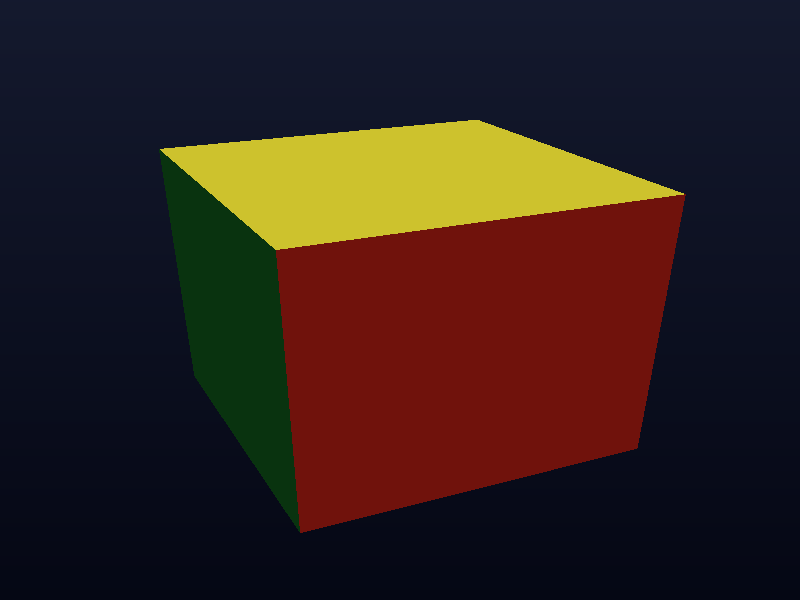
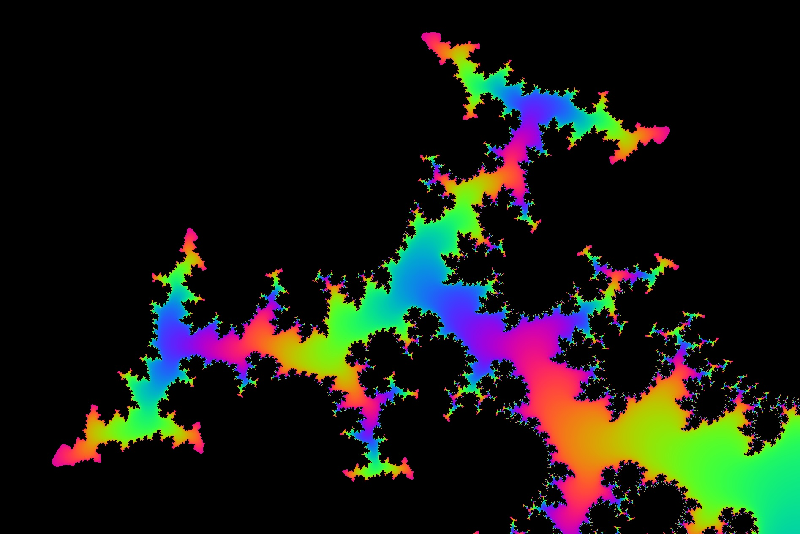
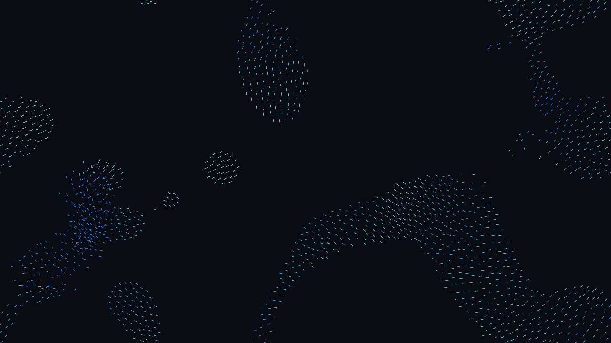

# Examples

This directory contains example cx programs, from single-file demos to full
applications. Each subdirectory is a `cx build` project (see
[Build system](../docs/290-build-system.md)); single `.cx` files compile with
`cx <file>`.

## Single-file programs

- [`hello.cx`](hello.cx) — minimal program printing `Hello world`.
- [`fibonacci.cx`](fibonacci.cx) — Fibonacci numbers with a `for` loop.
- [`fizzbuzz.cx`](fizzbuzz.cx) — FizzBuzz with `if`/`else if` chains.
- [`filter-map.cx`](filter-map.cx) — `List.filter`/`map` pipeline.
- [`ranges.cx`](ranges.cx) — ranges, loops, and list initialization.
- [`sieve.cx`](sieve.cx) — prime number sieve using a `List`.
- [`structs.cx`](structs.cx) — structs with default values, named arguments, and methods.
- [`operator-overloading.cx`](operator-overloading.cx) — complex numbers with `operator+`/`operator*`.
- [`printable.cx`](printable.cx) — implement `Printable::print`, get `toString()` for free.
- [`interpolation.cx`](interpolation.cx) — string interpolation (`$name`, `${expr}`).
- [`null-safety.cx`](null-safety.cx) — nullable types (`string?`) with compile-time null-safety, `??` fallback, and narrowing.
- [`result.cx`](result.cx) — fallible functions returning `Result` instead of throwing.
- [`json.cx`](json.cx) — read render settings out of a JSON blob.
- [`log-filter.cx`](log-filter.cx) — filter error lines out of application logs.
- [`parse-port.cx`](parse-port.cx) — parse and validate a server port (`int?` narrowing).
- [`signup.cx`](signup.cx) — signup validation returning errors as `Result` values.
- [`unions.cx`](unions.cx) — dispatch input events with a tagged union and `switch`; iterate and print all cases of a fieldless `enum`.
- [`lambdas.cx`](lambdas.cx) — lambdas, captures, and collection pipelines (`filter`/`map`/`sum()`).
- [`errors.cx`](errors.cx) — fallible texture creation returning `Result` values.
- [`vectors.cx`](vectors.cx) — fixed-size arrays as vectors: element-wise math, dot products, swizzles.
- [`cleanup.cx`](cleanup.cx) — scope-exit cleanup with `defer` and destructors.
- [`mandelbrot.cx`](mandelbrot.cx) — Mandelbrot set visualizer with a custom `Complex` type.
- [`brainfuck.cx`](brainfuck.cx) — Brainfuck interpreter.
- [`tree.cx`](tree.cx) — recursive directory listing using C APIs (`dirent.h`).

## Projects

- [`argparser/`](argparser/) — CLI argument parser library (`argparser.cx`,
  `help.cx`) and a demo task manager (`main.cx`). Supports boolean flags,
  string/integer options, positional arguments, git-style subcommands, and
  generated help text. Build with `cx build` to get the `todo` executable.
- [`embedding/`](embedding/) — embed cx in a C++ host: `embedding.cpp` loads
  `script1.cx`/`script2.cx` via `cx.h` (`cxCreateModule`,
  `cxLoadScriptFromFile`, `cxCompileModule`, `cxGetFunction`) and calls into
  them. See [`c-interop/`](c-interop/) for static linking in both directions.
- [`c-interop/`](c-interop/) — call C from cx through a direct header import
  (`mathlib.h`/`mathlib.c` called from `main.cx`), and cx from C through
  `extern` definitions (`cxlib.cx` exported to `main.c` via `cxlib.h`).
- [`cxx-interop/`](cxx-interop/) — call C++ from cx through a header
  import (`veclib.hpp`/`veclib.cpp` called from `main.cx`, including
  `std::vector` parameters), and cx from C++ through `extern "C++"`
  definitions (`cxlib.cx` exported to `main.cpp` via `cxlib.hpp`).
- [`opengl/`](opengl/) — minimal OpenGL triangle using GLFW for window
  management. Needs `pkg-config` and GLFW3 (`apt install pkg-config
  libglfw3-dev libgl1-mesa-dev`, `brew install pkg-config glfw3`). Build with
  `cx build`.
- [`asteroids/`](asteroids/) — bare-bones Asteroids clone using SDL3.
  See [`asteroids/README.md`](asteroids/README.md) for platform setup.
  Controls: arrow keys to move, space to shoot, esc to quit.

  
- [`voxel-game/`](voxel-game/) — Minecraft-style voxel game with procedurally
  generated textured terrain, first-person walking/jumping, block
  breaking/placing, rendered with OpenGL 3.3 via GLFW. See
  [`voxel-game/README.md`](voxel-game/README.md) for building, `--self-test`,
  and `--screenshot`. Controls: mouse to look, W/A/S/D to walk, Shift to
  sprint, Space to jump, left/right click to break/place, 1–6 to select block,
  Esc to quit.

  
- [`raytracer/`](raytracer/) — CPU ray tracer with zero dependencies:
  reflective spheres over a checkered ground plane, hard shadows,
  Blinn-Phong highlights, and a gradient sky, rendered to a PPM file.
  See [`raytracer/README.md`](raytracer/README.md) for options and
  `--self-test`.

  
- [`spinning-cube/`](spinning-cube/) — software rasterizer with zero
  dependencies: a spinning cube with flat shading and a depth buffer,
  rendered to a PPM file. See
  [`spinning-cube/README.md`](spinning-cube/README.md) for options and
  `--self-test`.

  
- [`fractal/`](fractal/) — GPU Mandelbrot explorer with smooth
  iteration-count coloring, rendered with OpenGL 3.3 via GLFW. Drag to
  pan, scroll to zoom at the cursor. See
  [`fractal/README.md`](fractal/README.md) for building and
  `--screenshot`.

  
- [`boids/`](boids/) — flocking simulation with 1500 boids
  (separation/alignment/cohesion over a uniform grid) in a toroidal
  world, rendered with SDL3 and colored by speed. See
  [`boids/README.md`](boids/README.md) for building and `--screenshot`.

  

## Building all examples

```sh
python3 build_examples.py --cx /path/to/cx
```

compiles every single-file program (`cx <file> -Werror`) and every project
directory (`cx build -Werror`), skipping `inputs/` fixtures. `embedding/` is
built with `-Wno-unused` since its entry point is called from the C++ host.
`tree.cx`, `asteroids`, `opengl`, `voxel-game`, `fractal`, and `boids` are skipped on Windows.
