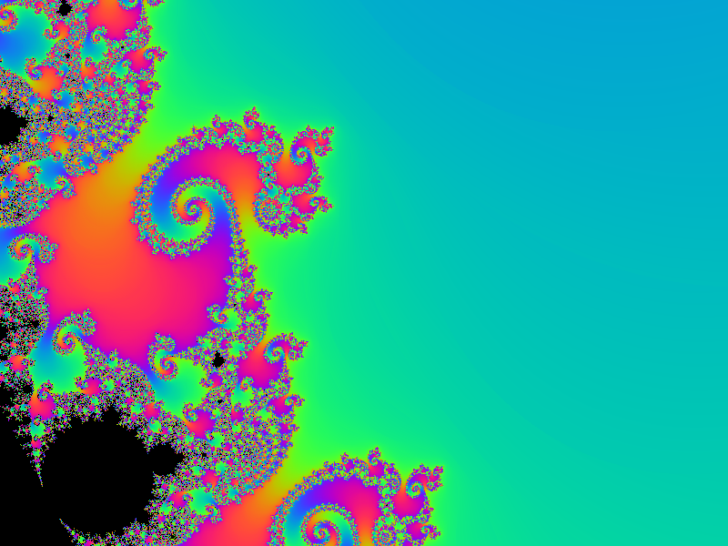

# fractal



A GPU Mandelbrot explorer written in cx: the fragment shader
evaluates the set per pixel with smooth iteration-count coloring,
so zooming and panning stay fluid. It uses the
[GLFW](https://www.glfw.org) C library for window management.

## Building

Install pkg-config and GLFW3, then run `cx build`. This creates a
`fractal` executable.

On Ubuntu, install the prerequisites with
`sudo apt-get install -y pkg-config libglfw3-dev libgl1-mesa-dev`.

On macOS, install the prerequisites with
`brew install pkg-config glfw3`.

## Running

Run from this directory so the program finds `assets/`:

```sh
./fractal
```

## Testing

A seahorse-valley close-up screenshot (binary PPM) with
scene-framing checks:

```sh
./fractal --screenshot shot.ppm
```

Note that `--screenshot` still initializes GLFW, so it needs a display
and will not run on a headless Linux server without X.

## Controls

- Left-drag: pan. Scroll: zoom at the cursor.
- Up/Down: double/halve the iteration limit. R: reset the view.
- Esc: quit.
