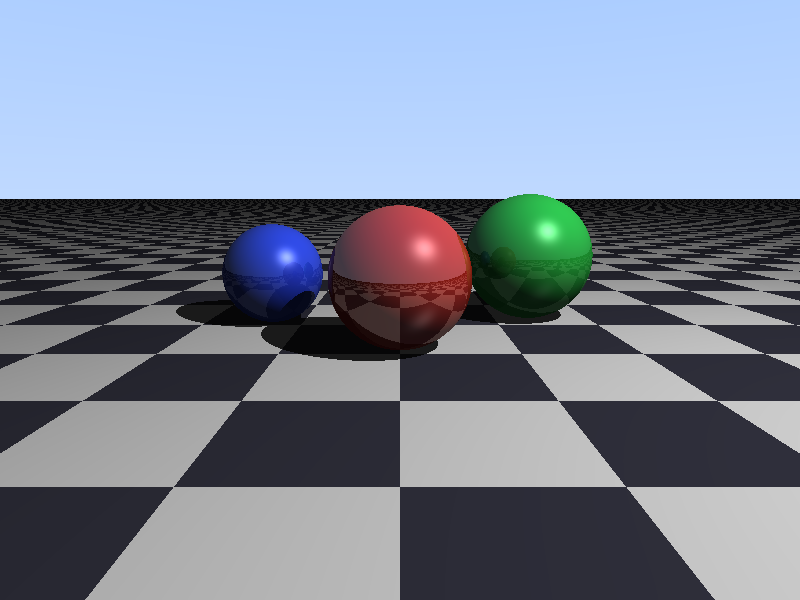

# raytracer



A CPU ray tracer written in cx: three reflective spheres over an
infinite checkered ground plane, with hard shadows, Blinn-Phong
highlights, reflections, and a gradient sky. No dependencies;
renders directly to a binary PPM file.

## Building

Run `cx build`. This creates a `raytracer` executable.

## Running

```sh
./raytracer [output.ppm] [width height]
```

Defaults to `render.ppm` at 800x600. An 800x600 render takes about
0.3 seconds with a debug build.

## Testing

```sh
./raytracer --self-test
```

checks the sphere, sky, and ground pixels of a tiny render plus a
full pixel count, printing `self-test passed` on success.
