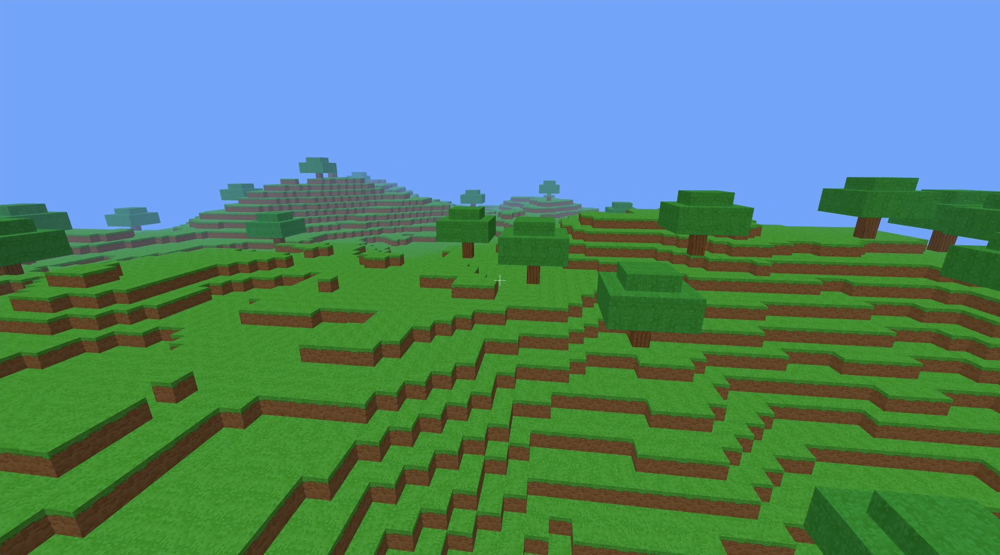

# voxel-game



A Minecraft-style voxel game written in cx: procedurally generated
and textured blocky terrain with trees, first-person walking and
jumping, block breaking and placing, rendered with OpenGL 3.3. It
uses the [GLFW](https://www.glfw.org) C library for window
management. Block textures are generated procedurally at startup
into a texture atlas (see `texture.cx`).

## Building

Install pkg-config and GLFW3, then run `cx build`. This creates a
`voxel-game` executable.

On Ubuntu, install the prerequisites with
`sudo apt-get install -y pkg-config libglfw3-dev libgl1-mesa-dev`.

On macOS, install the prerequisites with
`brew install pkg-config glfw`.

## Running

Run from this directory so the game finds `assets/`:

```sh
./voxel-game
```

## Testing

```sh
./voxel-game --self-test
```

checks math, noise, player physics, mouse look, raycasting, block
break/place handlers, world generation, meshing, and a top-down render
pixel, printing `self-test passed` on success.

`--debug` prints 1 Hz live state (position, yaw/pitch, fps, targeted
block) and unbuffered break/place/selection events while playing.

A spawn-view screenshot (binary PPM) with scene-framing checks:

```sh
./voxel-game --screenshot shot.ppm
```

## Controls

- Mouse: look around.
- W/A/S/D: walk. Left Shift: sprint. Space: jump.
- Left click: break the targeted block. Right click: place the selected block.
- 1-6: select grass, dirt, stone, sand, wood, leaves.
- Esc: quit.
